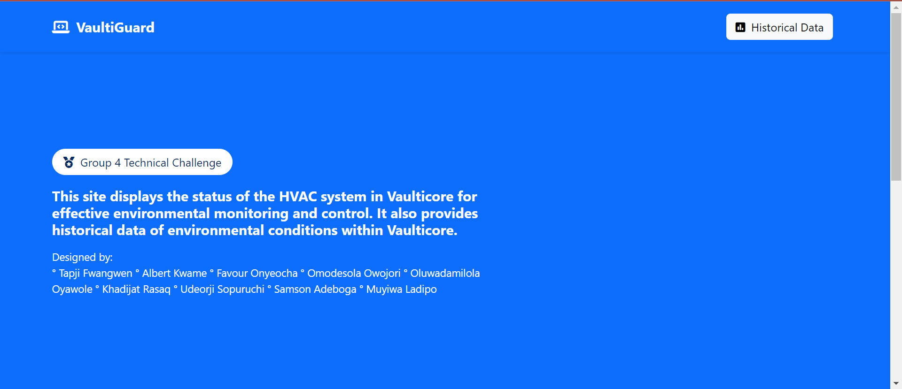
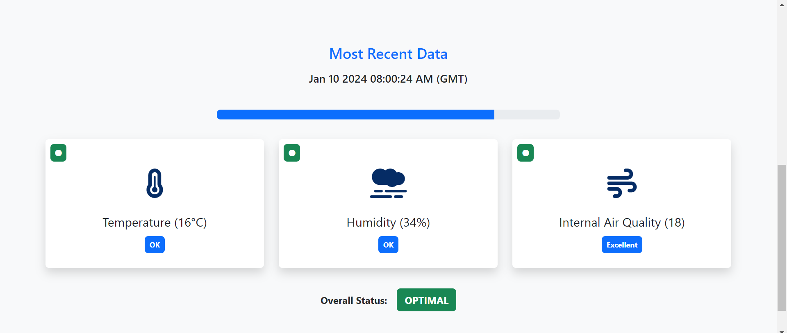
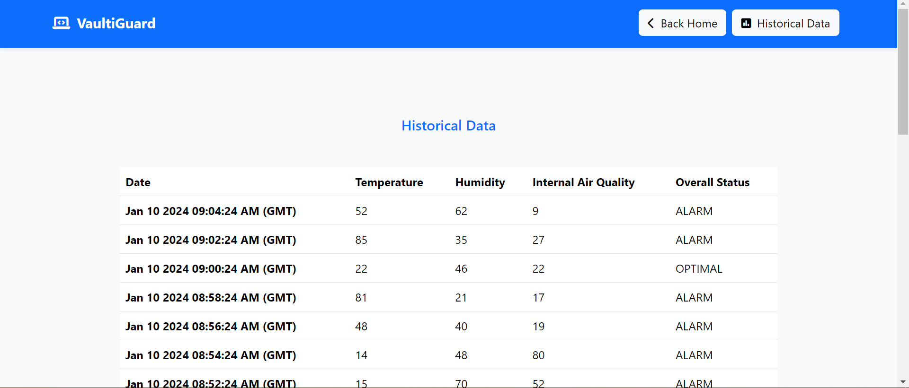

# Vaulticore Environmental Monitoring System

[](https://python.org)
[](https://djangoproject.com)

Welcome to the Vaulticore Environmental Monitoring System, a critical component in ensuring the safety and stability of Shalomium, the rare element pivotal for our transition away from fossil fuels. As the guardian of humanity's future, your role involves monitoring and responding to the environmental conditions within Vaulticore.





## Prerequisites
Before running the project, ensure that you have the following:

Python (version 3.6 or higher)
Django (version 3.0 or higher)
AWS DynamoDB credentials
Internet connection for real-time sensor readings

## Running the Project Locally
Clone the repository:
First, clone the repository to your local machine:
```bash
git clone https://git-codecommit.us-east-1.amazonaws.com/v1/repos/Group4_Repo
cd Group4_Repo/webapp
```
Install the requirements:
```bash
pip install -r requirements.txt
```
Run migrations:
```bash
python manage.py migrate
```
## Running the Project
Finally, run the development server:
```bash
python manage.py runserver
```

Open your web browser and navigate to `http://127.0.0.1:8000/`` to access the Vaulticore Environmental Monitoring System.

## Monitoring Interface
The monitoring interface displays the following information:

<ul>
<li> Raw Readings: Real-time data from the Aggregator Sensor. </li>
<li> Interpretation: Interpretation of the readings based on predefined attribute ranges. </li>
<li> Response Actions: Individual actions to initiate for specific sensor attributes. </li>
<li> Overall Environmental Status: Aggregated status based on all sensor readings. </li>
<li> Environmental Response Action: Recommended action to initiate within Vaulticore (NONE/OPTIMAL, WARNING, ALARM). </li>
</ul>